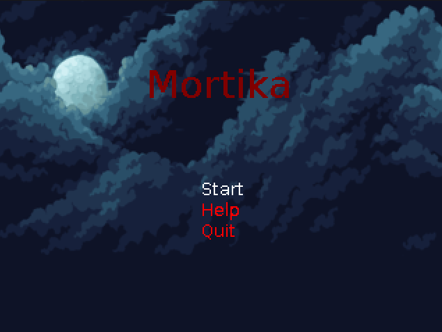
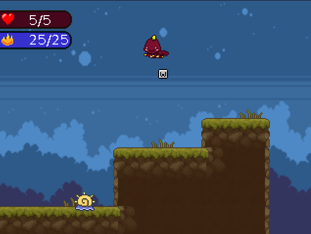
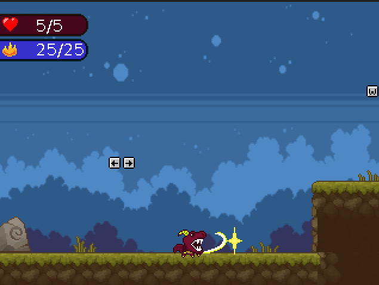

# Mortika

## Mortika: 2D платформер

Занурся у фентезійний світ Mortika, де ти перетворюєшся на відважного дракона, готового кинути виклик небезпекам заради порятунку принцес! У цьому захоплюючому 2D платформері тебе чекають хитромудрі пастки, підступні вороги та головоломки, які розкриють твої здібності до польотів, дихання вогнем та магії. Збирай скарби, відкривай нові здібності та доведи, що навіть дракон може бути справжнім героєм!

---

Мова: Java (21 version)

---

### Можливості

**Знешкоджуй ворогів за допомогою фаєрболів, пазурів, стрибай на дальню відстань та багато чого ще!**

### Опис коду

Сама гра працює на станах (GameState, Level1State, MenuState) які мають функції update - оновлення станів, draw - ініціалізація візуальних аспектів гри, keyPressed - натискання на кнопки та KeyReleased - їх відпускання.
Entity являє собою теку логіки усіх можливих сутностей у грі - гравця, фаєрболу, ворогів, музикального супроводження

### Як грати

_1 спосіб (складніший)_

1. Клонуйте репозиторій командою `git clone https://github.com/romalytv/Mortika`
2. Відкрийте директорію `/src/main/java/com/games`
3. Впишіть `javac **/*.java`
4. Відкрийте директорію `/Main`
5. Запустіть гру командою `java Game`

_2 спосіб (легший)_

1. Клонуйте репозиторій (наведено у 1 способі)
2. Відкрийте IntellijIdea
3. Натисніть на файл Game у директорії `/src/main/java/com/games/Main`
4. Запустіть гру

Гра все ще знаходиться в розробці. Чекайте апдейтів 😁